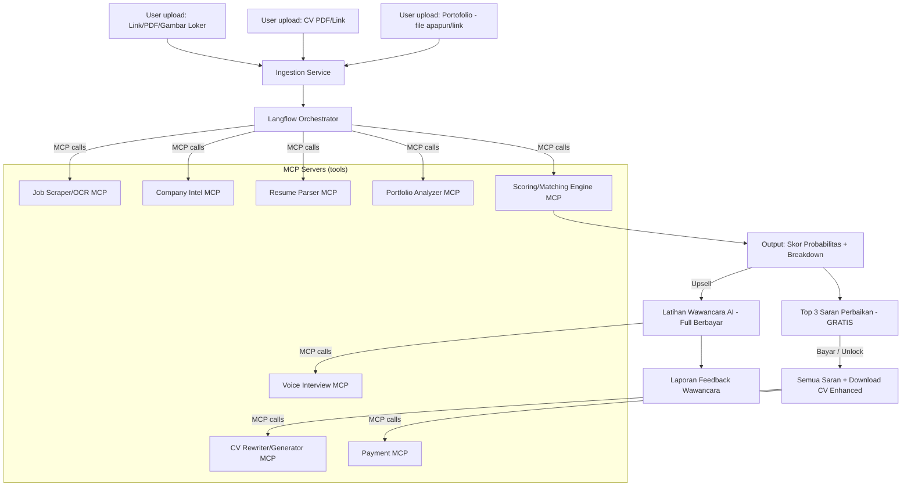
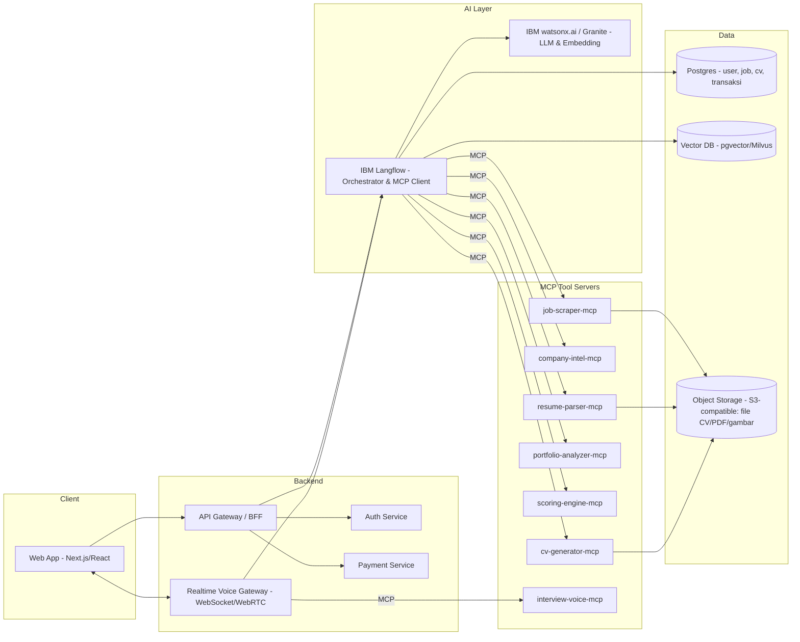

# Rancangan Produk: AI CV-Fit Scorer & Enhancer

## 0. Catatan Klarifikasi Tech Stack

| Kamu sebut | Perannya sebenarnya | Rekomendasi posisi dalam sistem |
|---|---|---|
| IBM Bob | Agentic *coding assistant* (dev tool, seperti Claude Code) — untuk menulis/review kode, bukan untuk inferensi runtime | Dipakai tim engineering **saat development** (build fitur, refactor, code review, migrasi). Tidak dipanggil oleh aplikasi saat user pakai produk. |
| IBM Langflow | Low-code orchestrator agent/LLM flow, mendukung MCP (client & bisa di-expose sebagai server/API) | **Runtime orchestration engine** — otak penghubung semua agent (scraping, parsing, scoring, suggestion, interview). |
| (baru ditambahkan) IBM watsonx.ai + Granite | Model LLM/embbeding IBM | Backbone LLM di dalam flow Langflow, supaya "IBM" benar-benar ada di jalur inferensi, bukan cuma di tooling dev. |
| MCP client-server | Protokol standar biar LLM/agent bisa "manggil" tool eksternal dengan aman & terstruktur | Semua kapabilitas (scraper, parser, generator PDF, payment, dsb) dibungkus jadi **MCP server**; Langflow (dan modul interview real-time) jadi **MCP client**-nya. |

Kalau kamu tetap ingin nama "Bob" nempel di narasi produk (mis. untuk marketing "dibangun pakai IBM Bob"), itu valid diklaim di *company profile/tech blog* ("dibangun dengan bantuan IBM Bob"), tapi jangan digambar di diagram arsitektur runtime karena akan membingungkan engineer yang baca nanti.

---

## 1. Alur Pengguna End-to-End



**Ringkasan tahap:**
1. **Input** — job posting (link / PDF / gambar), CV (PDF / link), portofolio (bebas format / link).
2. **Ekstraksi & Riset** — scraping loker, riset perusahaan (opsional), parsing CV & portofolio.
3. **Scoring** — hitung probabilitas kecocokan (bukan "keterima 100%", tapi estimasi peluang lolos screening awal).
4. **Monetisasi tahap 1** — 3 saran teratas gratis, sisanya + CV hasil enhance = berbayar.
5. **Monetisasi tahap 2** — sesi latihan wawancara AI real-time (voice, VAD) sebagai fitur premium terpisah, memanfaatkan semua konteks dari tahap sebelumnya.

---

## 2. Detail Pipeline Agent (di dalam Langflow)

### 2.1 Job Extraction Agent
- **Input:** link loker, atau file PDF/gambar.
- **Proses:**
  - Link → `fetch + HTML parsing` (fallback: headless browser render untuk SPA job board seperti LinkedIn/Glints/JobStreet).
  - PDF/gambar → OCR (Tesseract/GPT-vision/Granite-vision) → structured extraction.
- **Output terstruktur (JSON):**
  ```json
  {
    "company": "...",
    "position": "...",
    "seniority": "...",
    "requirements_hard_skill": ["..."],
    "requirements_soft_skill": ["..."],
    "responsibilities": ["..."],
    "location": "...",
    "salary_range": "optional",
    "applicants_count": "optional, jika tersedia di halaman",
    "quota": "optional",
    "deadline": "optional"
  }
  ```
- **Catatan legal/teknis:** scraping platform seperti LinkedIn sering melanggar ToS mereka dan rawan block/rate-limit. Untuk fitur "sudah berapa yang daftar" dan "kuota", perlakukan sebagai **best-effort, opsional, non-guaranteed** — jangan jadi dependency inti skor.

### 2.2 Company Intelligence Agent (opsional, nilai tambah)
- Cari via web search: berita terbaru perusahaan, produk yang sedang dirilis, funding round, job description serupa yang pernah diposting → untuk menyimpulkan *"kenapa mereka butuh posisi ini sekarang."*
- Output dipakai untuk dua hal:
  1. Konteks tambahan di rekomendasi CV (misal: "sebutkan pengalaman relevan dengan produk X yang baru mereka luncurkan").
  2. Bahan pertanyaan wawancara yang lebih tajam & spesifik ke bisnis perusahaan (tahap monetisasi 2).

### 2.3 CV Parser Agent
- Input: PDF/link (Google Docs, personal site, dsb).
- Ekstrak: riwayat kerja, pendidikan, skill, achievement (dan tandai mana yang **belum terkuantifikasi** — sinyal ini penting untuk saran perbaikan).

### 2.4 Portfolio Analyzer Agent
- Input: file apapun / link (GitHub, Behance, Notion, PDF case study, dsb).
- Untuk GitHub: analisis README, bahasa, aktivitas commit, kompleksitas proyek.
- Untuk desain/visual: gunakan model vision untuk menilai kualitas & relevansi terhadap requirement loker.
- Output: daftar proyek + relevansi tiap proyek terhadap posisi yang dilamar.

### 2.5 Matching & Scoring Engine
Kombinasi beberapa sinyal (bukan satu angka ajaib — supaya defensible & bisa dijelaskan ke user):

| Komponen | Metode | Bobot contoh |
|---|---|---|
| Keyword/skill coverage (ATS-style) | exact & fuzzy match requirement vs CV | 30% |
| Semantic fit pengalaman | embedding similarity (watsonx embedding / OpenAI-compatible) antara deskripsi pengalaman & tanggung jawab loker | 25% |
| Kesesuaian level (junior/mid/senior) | rule-based dari tahun pengalaman & judul | 15% |
| Relevansi portofolio | skor dari Portfolio Analyzer | 15% |
| Sinyal kompetisi (opsional) | rasio pelamar vs kuota, kalau data tersedia | 10% |
| Kelengkapan & kualitas CV (formatting, quantified achievement) | heuristik | 5% |

- **Output ke user:** jangan tampilkan sebagai "87% diterima" (menyesatkan & bisa jadi klaim palsu). Framing yang lebih jujur: *"Kecocokan CV kamu dengan syarat loker ini: Sedang-Tinggi (65–75%) — estimasi berbasis kecocokan skill & pengalaman, bukan jaminan hasil rekrutmen."*
- Sertakan **breakdown per kategori** supaya user paham kenapa skornya segitu → ini juga jadi bahan alami untuk fitur saran perbaikan.

### 2.6 Improvement Suggestion Agent
- Generate daftar saran, diranking berdasarkan estimasi dampak ke skor (mis. "+8% jika tambahkan metrik kuantitatif di bullet ini", "+5% jika reword skill X supaya match keyword ATS").
- **Gratis:** 3 saran berdampak terbesar (blurred/locked untuk sisanya, tampilkan judul saran tapi detail di-blur — pola umum paywall preview).
- **Berbayar (unlock):**
  - Semua saran detail.
  - CV hasil auto-enhance (menerapkan saran ke template CV baru) → download PDF/DOCX.

### 2.7 Interview Practice Agent (Fitur Premium Terpisah)
- Full context reuse: hasil scraping loker, riset perusahaan, hasil parsing CV/portofolio, dan gap yang teridentifikasi di scoring.
- Generate pertanyaan wawancara personal: behavioral + teknis + pertanyaan spesifik ke bisnis perusahaan (dari Company Intelligence Agent).
- Real-time voice loop:
  - **VAD** (Voice Activity Detection — misal Silero VAD/WebRTC VAD) untuk deteksi kapan user selesai bicara → tidak perlu tekan tombol.
  - **STT** (speech-to-text) → transkrip real-time.
  - **LLM turn** (via Langflow) → generate respons/pertanyaan lanjutan, termasuk follow-up probing kalau jawaban terlalu general.
  - **TTS** → suarakan balik ke user.
- Output akhir: laporan feedback (kekuatan jawaban, kelemahan, saran perbaikan jawaban, skor kesiapan wawancara).

---

## 3. Arsitektur Sistem (Komponen)



### Peran tiap layer
- **Frontend (Next.js/React):** upload form (link/file), dashboard skor, paywall UI (blur + CTA bayar), player wawancara voice.
- **API Gateway / BFF:** validasi request, orkestrasi job async (karena scraping+parsing bisa makan waktu → gunakan job queue, kirim status via polling/WebSocket).
- **Langflow:** menyusun flow visual untuk tiap pipeline (extraction → scoring → suggestion), bertindak sebagai **MCP client** ke semua tool server, dan bisa di-*expose* sebagai API endpoint yang dipanggil backend.
- **watsonx.ai (Granite models / embedding):** LLM utama untuk ekstraksi, reasoning, generasi teks. Bisa disubstitusi/dicampur model lain untuk task tertentu (mis. vision model untuk OCR gambar loker).
- **MCP Servers:** masing-masing kapabilitas dibungkus sebagai service independen dengan tool-tool MCP-nya sendiri — ini yang memudahkan reuse (misal `resume-parser-mcp` dipanggil ulang saat interview session butuh re-check CV).
- **Realtime Voice Gateway:** koneksi WebRTC/WebSocket khusus untuk audio streaming dua arah, pipeline VAD→STT→LLM→TTS harus low-latency (idealnya <1.5 detik round trip untuk terasa natural).
- **Data layer:** Postgres untuk data transaksional, Vector DB untuk semantic search (matching skill, retrieval konteks interview), Object Storage untuk file mentah.

---

## 4. Skema Monetisasi

| Tier | Fitur | Model harga |
|---|---|---|
| **Free** | Upload loker+CV+portofolio, lihat skor probabilitas & breakdown, 3 saran perbaikan teratas | Gratis |
| **Pro (per-analisis / subscription)** | Semua saran perbaikan detail, download CV yang sudah di-enhance (PDF/DOCX) | Bayar per unlock (mis. Rp 25–50rb per loker) atau subscription bulanan unlimited |
| **Premium** | Semua fitur Pro + sesi latihan wawancara AI voice (pakai VAD, konteks penuh dari analisis sebelumnya) + laporan feedback wawancara | Bayar per sesi atau bundling tertinggi |

**Pertimbangan tambahan:**
- Bundel: "beli Pro + Premium sekaligus" dengan diskon, karena interview practice paling bernilai kalau CV-nya sudah dioptimasi duluan.
- Retensi: simpan histori analisis per user supaya bisa cross-sell ("kamu sudah analisis 3 loker minggu ini, upgrade ke unlimited subscription?").
- Kredit sekali pakai (token wawancara) supaya user tidak perlu subscription kalau cuma butuh 1x sesi.

---

## 5. Pertimbangan Penting / Risiko

1. **Klaim "probabilitas keterima"** — hindari framing sebagai jaminan/prediksi presisi tinggi. Ini bisa jadi masalah reputasi & bahkan konsumen kalau user merasa "ditipu" karena skornya tinggi tapi ditolak. Selalu sertakan disclaimer bahwa ini estimasi berbasis kecocokan CV, bukan prediksi keputusan HR.
2. **Legalitas scraping** — banyak job board (LinkedIn dkk) melarang scraping otomatis di ToS mereka. Untuk MVP, prioritaskan sumber yang lebih permisif (loker via upload PDF/gambar screenshot dari user sendiri, atau job board yang punya API resmi) ketimbang scraping agresif ke platform besar.
3. **Privasi data CV** — CV & portofolio adalah data pribadi sensitif; perlu kebijakan retensi data, enkripsi at-rest, dan opsi hapus data oleh user (terutama kalau target pasar termasuk EU/berlaku GDPR-like expectation).
4. **Biaya inferensi voice real-time** — STT+TTS+LLM real-time cukup mahal per menit; pastikan pricing tier Premium menutup biaya ini dengan margin.
5. **Bias data "applicants count/kuota"** — karena sering tidak tersedia/reliable, jangan jadikan komponen skor dengan bobot besar; posisikan sebagai info tambahan kontekstual saja.

---

## 6. Rekomendasi Tahapan Build (MVP → Full)

1. **MVP:** Upload CV+loker (manual paste teks atau upload PDF) → scoring dasar (keyword+semantic match) → 3 saran gratis + paywall unlock saran lengkap & download CV. (Tanpa portofolio, tanpa company intel, tanpa voice interview dulu.)
2. **V2:** Tambah parsing loker dari link/gambar (OCR), tambah portfolio analyzer, tambah company intelligence agent.
3. **V3:** Bangun MCP server terpisah untuk tiap tool (refactor dari monolith MVP), integrasikan Langflow sebagai orchestrator resmi, mulai pakai watsonx/Granite.
4. **V4:** Fitur latihan wawancara AI voice dengan VAD — mulai dari versi sederhana (giliran bicara dengan VAD, belum full-duplex), baru optimasi latensi.

---

*Dokumen ini adalah rancangan arsitektur & alur produk tingkat tinggi. Detail skema database, kontrak API tiap MCP server, dan wireframe UI bisa dibuatkan terpisah kalau dibutuhkan.*
